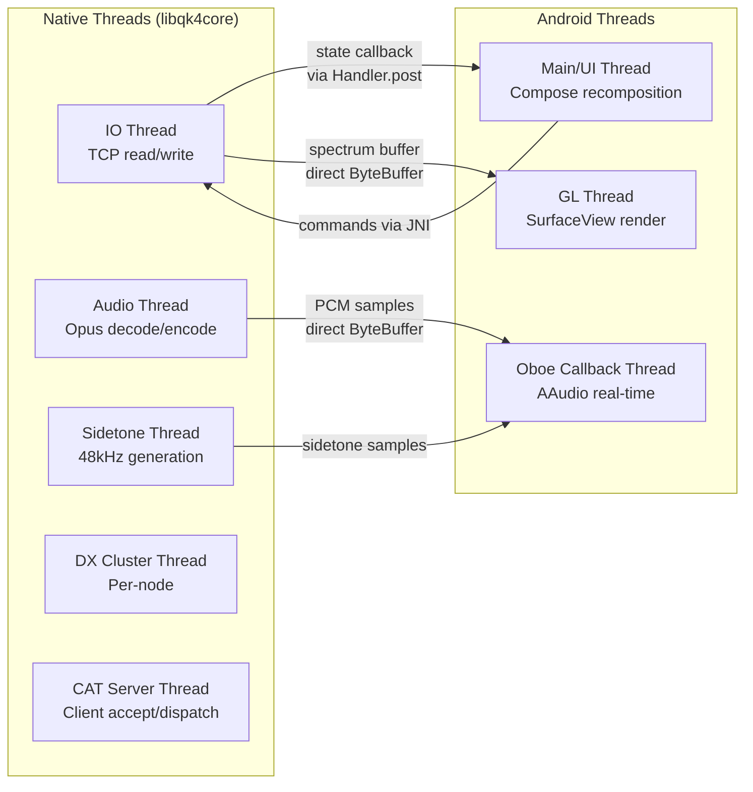
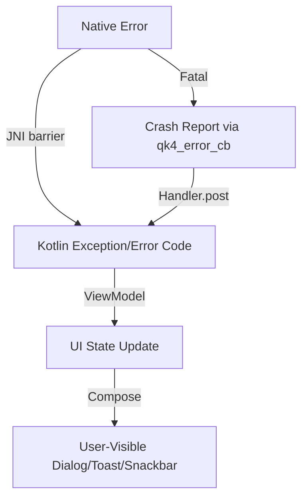
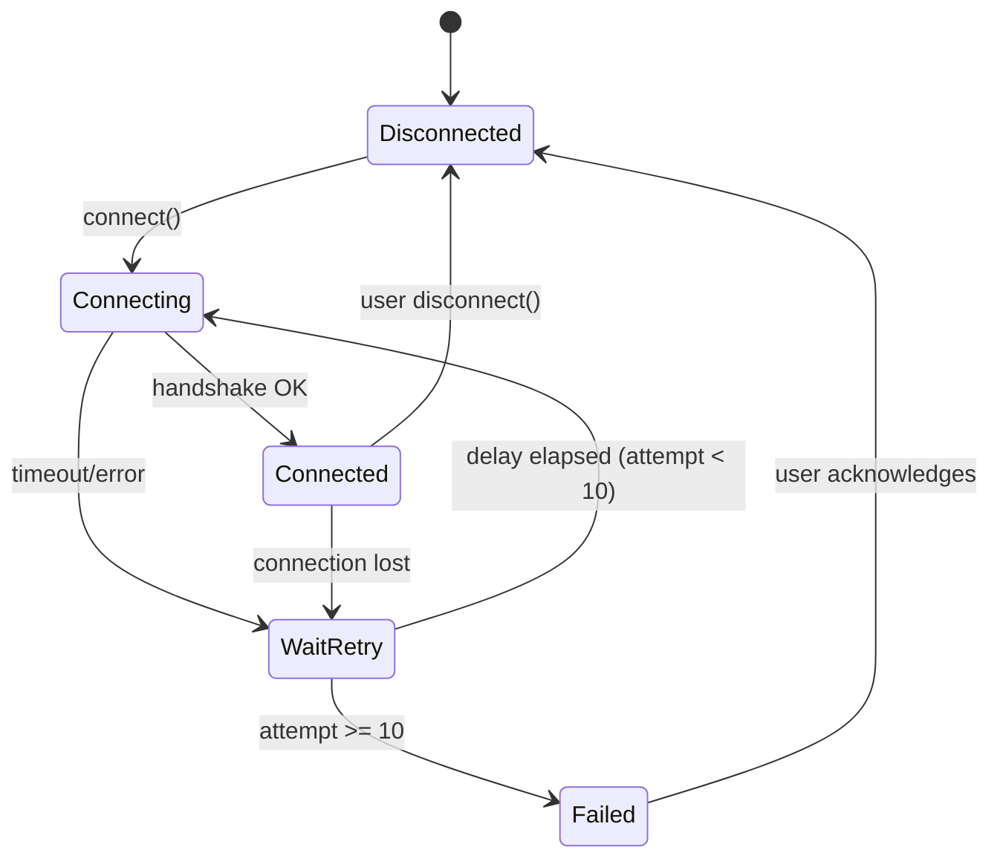

# Technical Design Document

## Overview

This document describes the technical design for porting the QK4 Amateur Radio Application to Android. The architecture follows a layered approach: a platform-independent C++ shared library (libqk4core) encapsulates all protocol, model, codec, and DSP logic; a JNI bridge provides zero-copy data transfer between native and managed code; and a Kotlin/Compose frontend delivers an adaptive Material 3 UI with GPU-accelerated spectrum rendering and low-latency audio via Oboe/AAudio.

The design prioritizes:
- **Reuse**: Proven desktop logic extracted without reimplementation
- **Performance**: Direct ByteBuffers, GPU rendering, AAudio exclusive mode
- **Reliability**: Foreground Service with wake locks, automatic reconnection
- **Responsiveness**: Adaptive layouts across phone/tablet form factors

## Architecture

### System Architecture Diagram

```mermaid
graph TB
    subgraph "Android Application"
        subgraph "Kotlin/Compose Layer"
            UI[Jetpack Compose UI]
            VM[ViewModels]
            ALM[Adaptive Layout Manager]
            NAV[Navigation / Bottom Nav]
        end

        subgraph "Service Layer"
            RCS[Radio Connection Service<br/>Foreground Service]
            DS[DataStore<br/>Settings Persistence]
        end

        subgraph "JNI Bridge"
            JNI[JNI Bridge Layer<br/>Direct ByteBuffers]
        end
    end

    subgraph "Native Layer (libqk4core.so)"
        subgraph "Network"
            TCP[TcpClient<br/>TCP/TLS/PSK]
            PROTO[Protocol<br/>K4 Binary Framing]
            MDNS[K4Discovery<br/>mDNS/NSD]
        end

        subgraph "Models"
            RS[RadioState<br/>11 Subsystems]
            HR[Handler Registry<br/>Longest-Prefix-First]
        end

        subgraph "Audio/DSP"
            OPUS[Opus Codec<br/>12kHz Stereo]
            NR[Noise Reduction<br/>LMS + SSNR]
            SPEC[Spectrum Processor]
            ST[Sidetone Generator]
        end

        subgraph "Services"
            CAT[CAT Server<br/>Port 9299]
            DXC[DX Cluster Client]
            KPA[KPA1500 Client]
        end

        subgraph "Utils"
            RU[RadioUtils<br/>Freq/Band/Span Math]
        end
    end

    subgraph "Rendering"
        GLES[OpenGL ES 3.0<br/>Spectrum SurfaceView]
    end

    subgraph "Audio Output"
        OBOE[Oboe/AAudio<br/>Low-Latency Playback]
    end

    UI --> VM
    VM --> JNI
    RCS --> JNI
    JNI --> TCP
    JNI --> RS
    JNI --> OPUS
    JNI --> CAT
    JNI --> DXC
    JNI --> KPA
    JNI --> MDNS
    JNI --> NR
    JNI --> SPEC
    JNI --> ST
    JNI --> RU
    SPEC --> GLES
    OPUS --> OBOE
    ST --> OBOE
    VM --> DS
    ALM --> UI
end
```

### Layered Architecture

| Layer | Technology | Responsibility |
|-------|-----------|----------------|
| UI | Kotlin, Jetpack Compose, Material 3 | Adaptive layouts, user interaction, state display |
| ViewModel | Kotlin, Hilt, StateFlow | UI state management, lifecycle awareness |
| Service | Android Foreground Service | Connection persistence, wake/WiFi locks |
| JNI Bridge | C/JNI, Direct ByteBuffers | Zero-copy data marshalling, thread dispatch |
| Native Core | C++17, POSIX, NDK r26+ | Protocol, models, codec, DSP, networking |
| Rendering | OpenGL ES 3.0, SurfaceView | GPU-accelerated spectrum/waterfall |
| Audio | Oboe/AAudio | Low-latency playback/capture, sidetone |

### Threading Model



**Thread Affinity Rules:**
- **IO Thread**: Owns TCP socket, protocol encode/decode, RadioState mutation. Single-threaded event loop.
- **Audio Thread**: Opus decode/encode, jitter buffer management. Feeds Oboe callback.
- **Sidetone Thread**: Real-time 48kHz sine generation. Mixes into Oboe output.
- **GL Thread**: Owned by SurfaceView. Receives spectrum float arrays via direct ByteBuffer.
- **Oboe Callback Thread**: Real-time priority. Pulls from ring buffer filled by Audio Thread.
- **Main Thread**: All Compose recomposition, ViewModel state updates. Receives callbacks via `Handler.post()`.

## Components and Interfaces

### 1. libqk4core — Native Core Library

**Build**: CMake with Android NDK toolchain. Single `CMakeLists.txt` with `QK4_PLATFORM` flag (`ANDROID` | `DESKTOP`).

**C API Surface** (all symbols `qk4_` prefixed, C linkage):

```c
// Lifecycle
qk4_handle_t qk4_create(const qk4_config_t* config);
void         qk4_destroy(qk4_handle_t handle);

// Connection
int32_t qk4_connect(qk4_handle_t h, const char* host, uint16_t port,
                     const uint8_t* psk, uint32_t psk_len, int32_t use_tls);
void    qk4_disconnect(qk4_handle_t h);
int32_t qk4_connection_state(qk4_handle_t h); // 0=disconnected, 1=connecting, 2=connected

// Radio Control
int32_t qk4_set_frequency(qk4_handle_t h, int32_t vfo, int64_t freq_hz);
int32_t qk4_set_mode(qk4_handle_t h, int32_t vfo, int32_t mode);
int32_t qk4_set_ptt(qk4_handle_t h, int32_t on);
int32_t qk4_set_tune(qk4_handle_t h, int32_t on);
int32_t qk4_set_power(qk4_handle_t h, int32_t watts);
int32_t qk4_set_band(qk4_handle_t h, int32_t band_id);
int32_t qk4_set_agc(qk4_handle_t h, int32_t vfo, int32_t agc_mode);
int32_t qk4_set_filter_bw(qk4_handle_t h, int32_t vfo, int32_t bandwidth_hz);
int32_t qk4_set_nr(qk4_handle_t h, int32_t vfo, int32_t algorithm, int32_t enabled, int32_t level);

// State Query
int64_t qk4_get_frequency(qk4_handle_t h, int32_t vfo);
int32_t qk4_get_mode(qk4_handle_t h, int32_t vfo);
int32_t qk4_get_smeter(qk4_handle_t h, int32_t vfo);
int32_t qk4_get_tx_state(qk4_handle_t h);
int32_t qk4_get_power_level(qk4_handle_t h);

// Callbacks (registered once)
typedef void (*qk4_state_cb)(void* ctx, const char* key, const uint8_t* data, uint32_t len);
typedef void (*qk4_spectrum_cb)(void* ctx, const float* bins, uint32_t count, int32_t vfo);
typedef void (*qk4_audio_cb)(void* ctx, const int16_t* pcm, uint32_t frame_count);
typedef void (*qk4_error_cb)(void* ctx, int32_t code, const char* message);

void qk4_set_state_callback(qk4_handle_t h, qk4_state_cb cb, void* ctx);
void qk4_set_spectrum_callback(qk4_handle_t h, qk4_spectrum_cb cb, void* ctx);
void qk4_set_audio_callback(qk4_handle_t h, qk4_audio_cb cb, void* ctx);
void qk4_set_error_callback(qk4_handle_t h, qk4_error_cb cb, void* ctx);

// mDNS Discovery
qk4_discovery_t qk4_discovery_start(qk4_handle_t h, void (*found_cb)(void* ctx, const char* host, const char* ip, uint16_t port), void* ctx);
void            qk4_discovery_stop(qk4_discovery_t d);

// CAT Server
int32_t qk4_cat_start(qk4_handle_t h, uint16_t port, int32_t max_clients);
void    qk4_cat_stop(qk4_handle_t h);

// DX Cluster
int32_t qk4_dxcluster_connect(qk4_handle_t h, const char* host, uint16_t port, const char* callsign);
void    qk4_dxcluster_disconnect(qk4_handle_t h);
typedef void (*qk4_spot_cb)(void* ctx, const char* callsign, int64_t freq_hz, const char* spotter, const char* comment, int64_t timestamp);
void    qk4_dxcluster_set_spot_callback(qk4_handle_t h, qk4_spot_cb cb, void* ctx);

// CW Keyer
void qk4_cw_key(qk4_handle_t h, int32_t element); // 0=dit, 1=dah, 2=release
void qk4_cw_set_speed(qk4_handle_t h, int32_t wpm);
void qk4_cw_set_mode(qk4_handle_t h, int32_t iambic_mode); // 0=A, 1=B

// KPA1500
int32_t qk4_kpa_connect(qk4_handle_t h);
void    qk4_kpa_disconnect(qk4_handle_t h);
int32_t qk4_kpa_set_operate(qk4_handle_t h, int32_t operate);
int32_t qk4_kpa_set_band(qk4_handle_t h, int32_t band_id);
typedef void (*qk4_kpa_status_cb)(void* ctx, float fwd_w, float ref_w, float swr, float temp_c, int32_t band, int32_t operate, int32_t fault);
void    qk4_kpa_set_status_callback(qk4_handle_t h, qk4_kpa_status_cb cb, void* ctx);

// Audio Control
void qk4_audio_set_volume(qk4_handle_t h, int32_t channel, int32_t level); // channel: 0=MAIN, 1=SUB
void qk4_audio_set_sidetone_pitch(qk4_handle_t h, int32_t hz);
void qk4_audio_set_jitter_buffer(qk4_handle_t h, int32_t ms);

// Spectrum Control
void qk4_spectrum_set_span(qk4_handle_t h, int32_t span_hz);
void qk4_spectrum_set_center(qk4_handle_t h, int64_t center_hz);
```

### 2. JNI Bridge

**Package**: `com.qk4.android.native`

```kotlin
object Qk4Bridge {
    // Loads libqk4core.so, returns true on success
    external fun initialize(config: Qk4Config): Boolean
    external fun destroy()

    // Connection
    external fun connect(host: String, port: Int, psk: ByteArray?, useTls: Boolean): Int
    external fun disconnect()
    external fun getConnectionState(): Int

    // Radio Control
    external fun setFrequency(vfo: Int, freqHz: Long): Int
    external fun setMode(vfo: Int, mode: Int): Int
    external fun setPtt(on: Boolean): Int
    external fun setTune(on: Boolean): Int
    external fun setPower(watts: Int): Int
    external fun setBand(bandId: Int): Int
    external fun setAgc(vfo: Int, agcMode: Int): Int
    external fun setFilterBw(vfo: Int, bandwidthHz: Int): Int
    external fun setNr(vfo: Int, algorithm: Int, enabled: Boolean, level: Int): Int

    // State Query
    external fun getFrequency(vfo: Int): Long
    external fun getMode(vfo: Int): Int
    external fun getSmeter(vfo: Int): Int
    external fun getTxState(): Int
    external fun getPowerLevel(): Int

    // Spectrum — returns direct ByteBuffer for zero-copy GL upload
    external fun getSpectrumBuffer(vfo: Int): ByteBuffer?

    // Audio — returns direct ByteBuffer for Oboe feed
    external fun getAudioBuffer(): ByteBuffer?

    // Discovery
    external fun startDiscovery(): Int
    external fun stopDiscovery()

    // CAT Server
    external fun startCatServer(port: Int, maxClients: Int): Int
    external fun stopCatServer()

    // DX Cluster
    external fun dxClusterConnect(host: String, port: Int, callsign: String): Int
    external fun dxClusterDisconnect()

    // CW
    external fun cwKey(element: Int)
    external fun cwSetSpeed(wpm: Int)
    external fun cwSetMode(iambicMode: Int)

    // KPA1500
    external fun kpaConnect(): Int
    external fun kpaDisconnect()
    external fun kpaSetOperate(operate: Boolean): Int
    external fun kpaSetBand(bandId: Int): Int

    // Audio Control
    external fun setVolume(channel: Int, level: Int)
    external fun setSidetonePitch(hz: Int)
    external fun setJitterBuffer(ms: Int)

    // Spectrum Control
    external fun setSpectrumSpan(spanHz: Int)
    external fun setSpectrumCenter(centerHz: Long)
}
```

**Callback Dispatch**: Native callbacks are registered in `JNI_OnLoad`. State callbacks post to the main looper via `ALooper_forThread()`. Spectrum and audio callbacks write directly to pre-allocated `DirectByteBuffer` objects and signal the consumer (GL thread / Oboe callback) via atomic flags.

### 3. Radio Connection Service

```kotlin
class RadioConnectionService : LifecycleService() {
    // Foreground service type: connectedDevice
    // Holds: PARTIAL_WAKE_LOCK, WIFI_MODE_FULL_HIGH_PERF lock
    // Notification: connection status, frequency, mode, PTT/Disconnect actions
    // START_STICKY for auto-restart
    // Reconnection: exponential backoff 1s→60s, max 10 attempts
}
```

### 4. Spectrum Renderer

**Technology**: OpenGL ES 3.0 via `GLSurfaceView` (or custom `SurfaceView` with EGL context).

**Shader Pipeline**:
| Shader | Purpose |
|--------|---------|
| `spectrum_trace.vert/frag` | Line strip for spectrum trace |
| `spectrum_fill.vert/frag` | Filled area below trace |
| `waterfall.vert/frag` | Texture-scrolling waterfall with color map LUT |
| `overlay.vert/frag` | Passband, markers, cursor, grid |

**Data Flow**: Spectrum float array arrives via `qk4_spectrum_cb` → written to `DirectByteBuffer` → GL thread uploads to VBO/texture via `glBufferSubData` each frame.

**Waterfall**: Circular texture buffer (480 rows). Each new spectrum row writes to the next row index. Vertex shader offsets UV to create scroll effect.

### 5. Audio Engine (Kotlin/Oboe)

```kotlin
class AudioEngine {
    // Oboe AAudio stream in exclusive mode, low-latency performance mode
    // Sample rate: 48kHz output (upsampled from 12kHz Opus decode)
    // Buffer: configurable jitter buffer (default 40ms = 1920 frames at 48kHz)
    // Channels: stereo (L=MAIN, R=SUB) with independent gain
    // Sidetone: mixed into output stream at 48kHz
    // Audio focus: duck by 12dB on transient focus loss
}
```

### 6. Adaptive Layout Manager

```kotlin
@Composable
fun AdaptiveRadioLayout(windowSizeClass: WindowSizeClass) {
    when {
        windowSizeClass.widthSizeClass == WindowWidthSizeClass.Compact -> CompactLayout()
        windowSizeClass.widthSizeClass == WindowWidthSizeClass.Medium -> MediumLayout()
        windowSizeClass.widthSizeClass == WindowWidthSizeClass.Expanded -> ExpandedLayout()
    }
}
```

| Layout | Width | Structure |
|--------|-------|-----------|
| Compact | <600dp | Bottom nav: Operate / Spectrum / Controls / Settings. VFO B collapsible. |
| Medium | 600–839dp | Two-pane vertical: spectrum top, controls bottom |
| Expanded | ≥840dp | Dual VFO side-by-side, spectrum, persistent control rail |

### 7. ViewModels

| ViewModel | Responsibility |
|-----------|---------------|
| `RadioViewModel` | VFO state, mode, S-meter, TX state, band |
| `SpectrumViewModel` | Span, center freq, touch-to-tune mapping |
| `AudioViewModel` | Volume levels, sidetone pitch, NR settings |
| `ConnectionViewModel` | Connection state, discovery results, profiles |
| `DxClusterViewModel` | Spot list (max 500), overlay data |
| `CwKeyerViewModel` | Speed, iambic mode, MIDI state |
| `KpaViewModel` | Amplifier status, fault alerts |
| `SettingsViewModel` | All persisted preferences |

## Data Models

### RadioState Subsystems (C++ structs in libqk4core)

```cpp
struct VfoState {
    int64_t frequency_hz;
    int32_t mode;          // enum: LSB=0, USB=1, CW=2, CW_R=3, DATA=4, DATA_R=5, AM=6, FM=7
    int32_t filter_bw_hz;
    int32_t agc_mode;      // OFF=0, SLOW=1, FAST=2
    int32_t smeter;        // 0-120 (S0=0, S9=54, S9+60=114)
    int32_t tuning_rate;   // Hz per step
    bool    active;
    bool    sub_on;
};

struct TxState {
    bool    ptt;
    bool    tune;
    int32_t power_watts;
    int32_t swr_x10;      // SWR * 10
    int32_t pa_current_ma;
};

struct SpectrumState {
    int32_t span_hz;
    int64_t center_hz;
    int32_t ref_level_db;
    int32_t bin_count;
};

struct AudioState {
    int32_t main_volume;   // 0-100
    int32_t sub_volume;    // 0-100
    int32_t sidetone_hz;   // 400-1000
    int32_t jitter_ms;     // prebuffer depth
};

struct NrState {
    bool    lms_enabled;
    int32_t lms_level;     // 1-10
    bool    ssnr_enabled;
    int32_t ssnr_level;    // 1-10
};

struct CwState {
    int32_t speed_wpm;     // 5-60
    int32_t iambic_mode;   // 0=A, 1=B
};

struct KpaState {
    bool    connected;
    bool    operate;
    float   fwd_watts;
    float   ref_watts;
    float   swr;
    float   temp_c;
    int32_t band;
    int32_t fault_code;    // 0=none
};

struct ConnectionState {
    int32_t state;         // 0=disconnected, 1=connecting, 2=connected
    int32_t reconnect_attempts;
    int64_t last_keepalive_ms;
};

struct CatServerState {
    bool    running;
    int32_t client_count;  // 0-4
    uint16_t port;
};

struct DxClusterState {
    bool    connected;
    int32_t spot_count;    // 0-500
};

// Top-level aggregate
struct RadioState {
    VfoState        vfo[2];       // [0]=A, [1]=B
    TxState         tx;
    SpectrumState   spectrum;
    AudioState      audio;
    NrState         nr[2];        // [0]=MAIN, [1]=SUB
    CwState         cw;
    KpaState        kpa;
    ConnectionState connection;
    CatServerState  cat;
    DxClusterState  dxcluster;
};
```

### Kotlin Data Classes (UI Layer)

```kotlin
data class VfoUiState(
    val frequencyHz: Long,
    val mode: RadioMode,
    val filterBwHz: Int,
    val agcMode: AgcMode,
    val smeter: Int,
    val tuningRate: TuningRate,
    val isActive: Boolean,
    val subOn: Boolean
)

data class RadioUiState(
    val vfoA: VfoUiState,
    val vfoB: VfoUiState,
    val txState: TxUiState,
    val connectionState: ConnectionUiState
)

data class DxSpot(
    val callsign: String,
    val frequencyHz: Long,
    val spotter: String,
    val comment: String,
    val timestamp: Long
)

data class ConnectionProfile(
    val id: Int,
    val name: String,
    val host: String,
    val port: Int,
    val psk: ByteArray?,
    val useTls: Boolean,
    val lastConnected: Long
)
```

### K4 Binary Protocol Frame

```
┌──────────────┬──────────────┬─────────────────────┬──────────────┐
│ START (4B)   │ LENGTH (4B)  │ PAYLOAD (variable)  │ END (4B)     │
│ 0xFEFDFCFB   │ Big-Endian   │ Command/Response    │ 0x00000000   │
└──────────────┴──────────────┴─────────────────────┴──────────────┘
```

### Settings Schema (DataStore Proto)

```protobuf
message QK4Settings {
    repeated ConnectionProfile profiles = 1;  // max 8
    AudioSettings audio = 2;
    SpectrumSettings spectrum = 3;
    CwSettings cw = 4;
    NrSettings nr = 5;
    DxClusterSettings dxcluster = 6;
    UiSettings ui = 7;
    int32 schema_version = 15;
}
```

## Correctness Properties

*A property is a characteristic or behavior that should hold true across all valid executions of a system — essentially, a formal statement about what the system should do. Properties serve as the bridge between human-readable specifications and machine-verifiable correctness guarantees.*

### Property 1: K4 Protocol Frame Round-Trip

*For any* valid command payload (arbitrary byte sequence up to maximum frame size), encoding it into a K4 binary frame (START marker + big-endian length + payload + END marker) and then decoding the frame SHALL produce the original payload byte-for-byte.

**Validates: Requirements 1.3**

### Property 2: Opus Codec Energy Preservation

*For any* valid PCM audio buffer (12kHz stereo, 16-bit samples), encoding with Opus and then decoding SHALL produce an output buffer with the same frame count and signal energy within ±3dB of the input energy (accounting for lossy compression).

**Validates: Requirements 1.5**

### Property 3: Spectrum Bin Count Invariant

*For any* valid audio input buffer and spectrum configuration (bin count N), the spectrum computation SHALL produce exactly N float values as output.

**Validates: Requirements 1.6**

### Property 4: Noise Reduction Energy Bound

*For any* valid audio input buffer, applying noise reduction (LMS or SSNR at any level 1-10) SHALL produce an output whose RMS energy does not exceed the input RMS energy.

**Validates: Requirements 1.6**

### Property 5: RadioUtils Frequency-Band Consistency

*For any* valid frequency within an amateur band, `freq_to_band(freq)` SHALL return a band ID such that `band_to_range(band_id)` contains that frequency. Conversely, *for any* valid band ID and any frequency within `band_to_range(band_id)`, `freq_to_band(freq)` SHALL return that band ID.

**Validates: Requirements 1.7**

### Property 6: JNI Marshalling Round-Trip

*For any* valid RadioState structure (containing arbitrary valid values for all 11 subsystems), marshalling from native to Kotlin representation and back to native SHALL produce a structure identical to the original.

**Validates: Requirements 2.2**

### Property 7: Native Exception Propagation

*For any* native error condition (null pointer, out-of-range, I/O error), the JNI bridge SHALL catch the native exception and deliver a Kotlin-side error containing the exception type name and a non-empty message string, without causing a process crash.

**Validates: Requirements 2.6**

### Property 8: Exponential Backoff Sequence

*For any* sequence of N consecutive reconnection failures (1 ≤ N ≤ 10), the delay before attempt N SHALL equal min(2^(N-1), 60) seconds. After 10 failed attempts, no further reconnection SHALL be attempted.

**Validates: Requirements 3.5, 3.7**

### Property 9: Frequency Formatting Round-Trip

*For any* valid frequency in Hz (0 to 54,000,000 Hz), formatting it as a period-separated string (e.g., "14.225.000") and parsing the string back SHALL yield the original frequency value.

**Validates: Requirements 5.1, 5.2**

### Property 10: S-Meter Value Mapping

*For any* raw S-meter integer value in the range [0, 120], the display mapping function SHALL produce a valid S-unit string in the set {S0, S1, ..., S9, S9+10, S9+20, ..., S9+60}, and the mapping SHALL be monotonically non-decreasing (higher raw values never map to lower S-units).

**Validates: Requirements 5.4**

### Property 11: Touch-to-Frequency Mapping

*For any* touch X-coordinate within the spectrum display bounds, given a center frequency and span, the mapped frequency SHALL equal `center - span/2 + (x / width) * span` within a tolerance of ±1 frequency bin width.

**Validates: Requirements 6.4**

### Property 12: Span Tier Snapping

*For any* pinch gesture ratio and current span value, the resulting span SHALL be a member of the K4 radio's supported span tier set, and the direction of change (wider/narrower) SHALL match the pinch direction (expand/contract).

**Validates: Requirements 6.5**

### Property 13: Spectrum Scroll Band Clamping

*For any* horizontal drag delta, current center frequency, current span, and active band boundaries, the resulting center frequency SHALL keep the entire displayed range (center ± span/2) within the band's lower and upper frequency limits.

**Validates: Requirements 6.6**

### Property 14: Volume Scaling Linearity

*For any* PCM sample value and volume level (0-100), the output sample SHALL equal `input * (volume / 100.0)` (linear scaling), with volume 0 producing silence and volume 100 producing the unmodified sample.

**Validates: Requirements 7.3**

### Property 15: Sidetone Frequency Accuracy

*For any* configured sidetone pitch in the range [400, 1000] Hz, the generated audio signal's dominant frequency (measured via FFT) SHALL be within ±1 Hz of the configured pitch.

**Validates: Requirements 7.7**

### Property 16: Mode-to-Filter-Bandwidth Mapping

*For any* valid operating mode, the set of available filter bandwidths returned by the mode-dependent control logic SHALL exactly match the K4 specification's defined bandwidth options for that mode, and SHALL be non-empty.

**Validates: Requirements 8.3**

### Property 17: Layout Breakpoint Selection

*For any* screen width in dp, the layout manager SHALL select Compact for width < 600, Medium for 600 ≤ width < 840, and Expanded for width ≥ 840. The selection SHALL be deterministic and consistent for the same width value.

**Validates: Requirements 9.1, 9.2, 9.3**

### Property 18: State Preservation Across Configuration Change

*For any* valid application state (VFO frequencies, connection status, in-progress input), a configuration change (orientation rotation) SHALL preserve all state fields — the state before and after the change SHALL be identical.

**Validates: Requirements 9.4**

### Property 19: Swipe Tuning Delta

*For any* VFO with a current frequency and tuning rate, a single upward swipe SHALL increase the frequency by exactly the tuning rate, and a single downward swipe SHALL decrease it by exactly the tuning rate.

**Validates: Requirements 10.1**

### Property 20: Tuning Rate Cycling

*For any* current tuning rate in the defined sequence (1, 10, 20, 50, 100, 200, 500, 1000, 2000, 5000, 10000 Hz), tapping the rate indicator SHALL advance to the next rate in the sequence, with 10000 wrapping to 1.

**Validates: Requirements 10.2**

### Property 21: Rotation Gesture Step Count

*For any* rotation angle θ (in degrees), the number of tuning steps generated SHALL equal floor(|θ| / 10), with clockwise producing positive frequency change and counter-clockwise producing negative frequency change.

**Validates: Requirements 10.4**

### Property 22: Frequency Range Validation

*For any* frequency value and active band, the validation function SHALL accept the frequency if and only if it falls within the band's defined lower and upper limits (inclusive). Values outside the range SHALL be rejected.

**Validates: Requirements 10.6**

### Property 23: CAT Query Response Correctness

*For any* valid Elecraft/Kenwood query command and any RadioState, the CAT server response SHALL contain the correctly formatted value from the corresponding RadioState getter, matching the Elecraft protocol specification.

**Validates: Requirements 11.2**

### Property 24: CAT Invalid Command Rejection

*For any* string that does not conform to the Elecraft/Kenwood command format (invalid prefix, missing terminator, unknown command code), the CAT server SHALL return an error response without modifying radio state or disconnecting other clients.

**Validates: Requirements 11.4**

### Property 25: DX Spot List FIFO Eviction

*For any* sequence of N spots where N > 500, the spot list SHALL contain exactly 500 spots, and the retained spots SHALL be the 500 most recently received spots (oldest evicted first).

**Validates: Requirements 12.2**

### Property 26: Iambic Keyer Element Generation

*For any* sequence of paddle inputs (dit/dah press/release events with timing), the iambic keyer in Mode A SHALL stop element generation on paddle release, and in Mode B SHALL complete the alternate element if both paddles were squeezed. The output element timing SHALL conform to the configured WPM speed.

**Validates: Requirements 13.6**

### Property 27: Discovery List Sort Order

*For any* set of discovered radios and previously connected radios, the displayed list SHALL show all previously connected radios before any newly discovered radios, preserving relative order within each group.

**Validates: Requirements 16.2**

### Property 28: Connection Address Validation

*For any* string input as IP address and integer input as port, the validation function SHALL accept the input if and only if the IP matches a valid IPv4 dotted-decimal format (or valid IPv6) AND the port is in the range [1, 65535]. All other inputs SHALL be rejected with an appropriate error indication.

**Validates: Requirements 16.4, 16.5**

### Property 29: Settings Partial Reset on Corruption

*For any* persisted settings blob where a subset of fields fail schema validation, the reset logic SHALL restore only the invalid fields to their default values while preserving all valid fields unchanged.

**Validates: Requirements 17.5**

### Property 30: Settings Migration Preservation

*For any* valid settings in schema version N, migrating to schema version N+1 SHALL preserve all user-set values — no data SHALL be lost or altered during migration.

**Validates: Requirements 17.7**

## Error Handling

### Error Categories and Strategies

| Category | Source | Strategy | User Impact |
|----------|--------|----------|-------------|
| Network Failure | TCP disconnect, timeout | Auto-reconnect with exponential backoff (1s→60s, max 10 attempts) | Toast + notification update |
| TLS/PSK Error | Handshake failure, bad key | Immediate error, no retry | Dialog with specific error |
| Protocol Error | Malformed K4 frame | Log + discard frame, continue | Silent (logged) |
| Native Crash | Segfault, null deref in libqk4core | JNI exception barrier catches, reports to Kotlin | Error dialog, offer reconnect |
| Audio Underrun | Network jitter exceeds buffer | Insert silence, continue stream | Brief audio gap |
| GPU Error | GLES context lost | Recreate context, reload shaders | Brief visual glitch |
| DX Cluster Overflow | Buffer > 64KB | Disconnect, discard, notify | Toast notification |
| KPA1500 Fault | Amplifier hardware fault | Persistent alert until acknowledged | Modal alert |
| Settings Corruption | Schema mismatch on load | Partial reset to defaults | Info message listing reset fields |
| Service Kill | Android OOM killer | START_STICKY restart, reconnect | Brief interruption |

### Error Propagation Path



### Reconnection State Machine



### Native Exception Barrier (JNI)

```cpp
// Every JNI function wraps native calls:
extern "C" JNIEXPORT jint JNICALL
Java_com_qk4_android_native_Qk4Bridge_setFrequency(JNIEnv* env, jobject, jint vfo, jlong freq) {
    try {
        return qk4_set_frequency(g_handle, vfo, freq);
    } catch (const std::exception& e) {
        env->ThrowNew(env->FindClass("java/lang/RuntimeException"), e.what());
        return -1;
    } catch (...) {
        env->ThrowNew(env->FindClass("java/lang/RuntimeException"), "Unknown native error");
        return -1;
    }
}
```

## Testing Strategy

### Testing Pyramid

```
         ┌─────────────┐
         │  E2E Tests  │  Instrumented (device/emulator)
         │   (~10)     │  Connection flow, audio playback
         ├─────────────┤
         │ Integration │  JNI bridge, Service lifecycle,
         │   (~40)     │  Network with mock server
         ├─────────────┤
         │   Unit +    │  Pure logic, ViewModels,
         │  Property   │  Protocol, RadioUtils, DSP
         │  (~200+)    │
         └─────────────┘
```

### Property-Based Testing Configuration

**Library**: [fast-check](https://github.com/dubzzz/fast-check) for Kotlin/JVM via [jqwik](https://jqwik.net/) (JUnit 5 property-based testing engine for JVM)

For native C++ properties: [RapidCheck](https://github.com/emil-e/rapidcheck) integrated with Google Test.

**Configuration**:
- Minimum 100 iterations per property test
- Seed logged for reproducibility
- Shrinking enabled for minimal failing examples

**Tagging Convention**:
```kotlin
@Property(tries = 100)
@Tag("Feature: qk4-android-port, Property 1: K4 Protocol Frame Round-Trip")
fun protocolRoundTrip(@ForAll payload: ByteArray) { ... }
```

```cpp
// C++ with RapidCheck
RC_GTEST_PROP(ProtocolTest, RoundTrip, (std::vector<uint8_t> payload)) {
    // Feature: qk4-android-port, Property 1: K4 Protocol Frame Round-Trip
    auto frame = k4_encode(payload);
    auto decoded = k4_decode(frame);
    RC_ASSERT(decoded == payload);
}
```

### Unit Test Focus Areas

| Area | Framework | Focus |
|------|-----------|-------|
| RadioUtils | Google Test (C++) | Frequency math, band lookup, span tiers |
| Protocol | Google Test (C++) | Frame encode/decode, edge cases (empty, max size) |
| RadioState | Google Test (C++) | Handler dispatch, subsystem updates |
| ViewModels | JUnit 5 + Turbine | State flows, event handling |
| Formatting | JUnit 5 | Frequency display, S-meter mapping |
| Validation | JUnit 5 | IP/port validation, frequency range checks |
| Layout | Compose UI Test | Breakpoint selection, content visibility |

### Integration Test Focus Areas

| Area | Framework | Focus |
|------|-----------|-------|
| JNI Bridge | Android Instrumented | Load library, marshal data, callbacks |
| Network | Mock TCP server | TLS handshake, reconnection, keepalive |
| Service | ServiceTestRule | Foreground service lifecycle, wake locks |
| Audio | Oboe test harness | Stream creation, underrun recovery |
| CAT Server | TCP client test | Command/response, multi-client |
| Discovery | NSD mock | mDNS response handling |

### Dual Testing Approach

- **Property tests** verify universal correctness (protocol round-trips, math invariants, state preservation)
- **Unit tests** verify specific examples and edge cases (empty payloads, boundary frequencies, mode transitions)
- **Integration tests** verify component wiring (JNI loads correctly, service starts, audio streams)
- **E2E tests** verify user-facing flows (connect → tune → hear audio → disconnect)

Property tests handle comprehensive input coverage through randomization. Unit tests pin specific known-good behaviors and regression cases. Together they provide confidence that both the general properties hold and specific critical paths work correctly.

